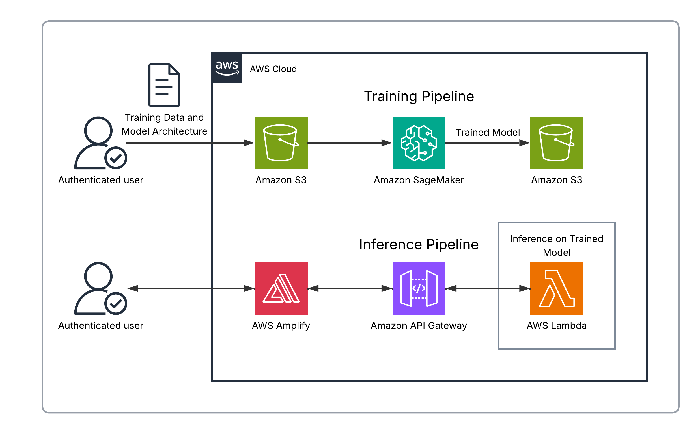

# Automated CPAK Measurement

| Index                         | Description                                         |
|:------------------------------|:----------------------------------------------------|
| [Overview](#overview)         | See what this project does and its key capabilities |
| [Demo](#demo)                 | View the demo video                                 |
| [Description](#description)   | Learn about the problem and our approach            |
| [Architecture](#architecture) | View the system architecture diagram                |
| [Tech Stack](#tech-stack)     | Technologies and services used                      |
| [Deployment](#deployment)     | How to install and deploy the solution              |
| [Usage](#usage)               | How to use the application                          |
| [Costs](#costs)               | Estimated AWS costs for running the solution        |
| [Credits](#credits)           | Meet the team behind this project                   |
| [License](#license)           | See the project's license information               |
| [Disclaimers](#disclaimers)   | Important legal disclaimers                         |

---

# Overview

**Automated CPAK Measurement** is an AI-powered tool that automatically measures knee alignment from long-leg radiographs. It reduces a 15-minute manual measurement task to seconds while achieving a mean error of less than one degree compared to expert measurements.

Before knee replacement surgery, surgeons must measure the Coronal Plane Alignment of the Knee (CPAK) by manually placing markers on X-rays and calculating angles. This tool automates that process using a U-Net neural network that identifies eight anatomical landmarks per leg and computes the Lateral Distal Femoral Angle (LDFA) and Medial Proximal Tibial Angle (MPTA).

**Key capabilities include:**

- **Automated Landmark Detection**: U-Net model identifies femoral head center, knee centers, ankle center, and joint line endpoints on both legs simultaneously
- **Instant Angle Calculation**: Computes LDFA, MPTA, and CPAK classification type in seconds
- **Human-in-the-Loop Verification**: Overlays predicted landmarks and measurement lines directly on the X-ray so surgeons can visually verify results before accepting them
- **Adjustable Predictions**: Drag-and-drop interface allows manual refinement of any landmark position with automatic angle recalculation
- **Export with Annotations**: Generate annotated images showing all measurements for documentation

This repository contains both the inference application (deployable to AWS) and the training pipeline used to develop the model.

---

# Demo

https://github.com/user-attachments/assets/1ece1945-87a5-4412-a676-07bc933ecec8

---

# Description

## Problem Statement

Over 700,000 knee replacement surgeries are performed in the United States each year. Before each procedure, surgeons must take a long-leg radiograph (a weight-bearing X-ray from hip to ankle) and manually place markers at the center of the femoral head, knee joint, and ankle. From these points, they measure the angles that will guide how the prosthetic joint is aligned.

This manual measurement process takes approximately 15 minutes per patient. With multiple surgeons performing these measurements daily, this represents a significant amount of expensive clinical time. Additionally, there is inherent variability between users in exactly where they place the anatomical markers.

## Our Approach

**U-Net Landmark Detection** — The core of the solution is a U-Net convolutional neural network trained to identify eight anatomical landmarks on each leg: femoral head center, knee center (femoral), knee center (tibial), ankle center, and four joint line endpoints (medial/lateral upper and lower). The model processes the radiograph and outputs heatmaps for each landmark, from which the precise coordinates are extracted.

**Serverless Inference Pipeline** — The trained model runs on AWS Lambda using ONNX Runtime for efficient CPU-based inference. API Gateway exposes the inference endpoint, and Cognito handles user authentication. This serverless architecture scales automatically and incurs costs only when processing images.

**Human-in-the-Loop Interface** — The React frontend displays the predicted landmarks overlaid directly on the X-ray, allowing surgeons to visually verify that the model's predictions are reasonable before accepting the measurements. If any landmark needs adjustment, users can drag it to the correct position and the angles recalculate automatically. This design ensures surgeons maintain control and can trust the output.

## Training & Validation

The U-Net model was trained on over 300 manually annotated long-leg radiographs from the NIH Osteoarthritis Initiative dataset. On a held-out test set, the final model achieved a mean keypoint error of approximately 1.8 mm and a mean absolute error of less than one degree for both LDFA and MPTA angle measurements.

---

# Architecture



---

# Tech Stack

## Inference Application

| Category     | Technology                                                                 | Purpose                                      |
|:-------------|:---------------------------------------------------------------------------|:---------------------------------------------|
| **Frontend** | [React](https://react.dev/)                                                | User interface framework                     |
|              | [Vite](https://vitejs.dev/)                                                | Build tool and dev server                    |
|              | [Tailwind CSS](https://tailwindcss.com/)                                   | Styling                                      |
| **Backend**  | [ONNX Runtime](https://onnxruntime.ai/)                                    | Model inference engine                       |
|              | [Python](https://www.python.org/)                                          | Lambda function runtime                      |
| **AWS**      | [Lambda](https://aws.amazon.com/lambda/)                                   | Serverless inference compute                 |
|              | [API Gateway](https://aws.amazon.com/api-gateway/)                         | REST API endpoint                            |
|              | [Cognito](https://aws.amazon.com/cognito/)                                 | User authentication                          |
|              | [Amplify Hosting](https://aws.amazon.com/amplify/)                         | Frontend hosting                             |
| **IaC**      | [AWS CDK](https://aws.amazon.com/cdk/)                                     | Infrastructure as code                       |

## Training Pipeline

| Category     | Technology                                                                 | Purpose                                      |
|:-------------|:---------------------------------------------------------------------------|:---------------------------------------------|
| **ML**       | [PyTorch](https://pytorch.org/)                                            | Model training framework                     |
| **AWS**      | [SageMaker](https://aws.amazon.com/sagemaker/)                             | GPU training jobs                            |
|              | [S3](https://aws.amazon.com/s3/)                                           | Training data and model artifact storage     |
|              | [Lambda](https://aws.amazon.com/lambda/)                                   | Reports API                                  |
|              | [API Gateway](https://aws.amazon.com/api-gateway/)                         | Reports API endpoint                         |
|              | [Amplify Hosting](https://aws.amazon.com/amplify/)                         | Training reports dashboard                   |
| **IaC**      | [AWS CDK](https://aws.amazon.com/cdk/)                                     | Infrastructure as code                       |

---

# Model Training

See the [User Guide](docs/USERGUIDE.md#training-pipeline) for detailed instructions on:
- Getting data from NIH
- Annotating X-ray images
- Uploading data to S3
- Running SageMaker training jobs
- Converting models to ONNX

---

# Deployment

For full deployment instructions, see the [User Guide](docs/USERGUIDE.md#application-pipeline).

## Quick Start

1. Ensure prerequisites are installed: Node.js 24+, AWS CLI, Docker
2. Configure AWS credentials: `aws configure`
3. Run the interactive deployment script:

```bash
./deploy.sh
```

Select option **1) Inference** to deploy the inference application (infrastructure + frontend), or option **3) Everything** to deploy both inference and training stacks.

---

# Usage

1. **Access the Application** — Run `./deploy.sh` and select option **6) Show frontend URLs** to get the Amplify URL

2. **Invite Users** — Run `./deploy.sh` and select option **5) Invite user to inference app**. Enter the user's email address—they'll receive a temporary password via email.

3. **Log In** — Enter your credentials. On first login, you'll be prompted to set a new password.

4. **Upload an Image** — Click "Select Image" and choose a long-leg radiograph (PNG, JPG, or DICOM)

5. **Run Analysis** — Click "Analyze" to send the image to the inference API. The model will detect anatomical landmarks on both legs.

6. **Verify Landmarks** — Review the predicted landmark positions overlaid on the image. Use the visibility toggles to show/hide points and lines for each leg.

7. **Adjust if Needed** — Drag any landmark to refine its position. Angles recalculate automatically as you move points.

8. **Review Measurements** — The sidebar displays LDFA, MPTA, and CPAK classification type for each leg

9. **Export Results** — Click "Export" to download an annotated image with all landmarks, lines, and measurements overlaid

---

# Costs

## Training Pipeline

### Estimated Per-Training-Run Costs

| Service                      | Estimated Cost | Notes                              |
|:-----------------------------|---------------:|:-----------------------------------|
| SageMaker (ml.g4dn.xlarge) |         ~$0.86 | Per 70-minute training job         |
| S3                           |        <$0.10  | Training data and model storage    |
| **Total**                    |     **~$0.91** |                                    |

## Inference Application

### Estimated Monthly Costs

| Service          | Estimated Cost | Notes                                                  |
|:-----------------|---------------:|:-------------------------------------------------------|
| Cognito          |            ~$0 | Free tier covers 10,000 MAUs                           |
| AWS Amplify      |            ~$0 | Free tier covers most small deployments                |
| **Total**        |        **~$0** |                                                        |

### Estimated Per-Inference Costs

| Service                | Cost per invocation |
|:-----------------------|--------------------:|
| Lambda (4096 MB, ~10s) |           ~$0.0007  |
| API Gateway            |         ~$0.000001  |
| **Total**              |       **<$0.001**   |

> **Note:** Cost estimates based on AWS pricing as of 2026. Actual costs may vary by region and usage patterns.

---

# Credits

**Automated CPAK Measurement** is an open-source project developed by the University of Pittsburgh Health Sciences and Sports Analytics Cloud Innovation Center.

**Development Team:**

- [Gary Farrell](https://www.linkedin.com/in/gary-farrell/)
- [Matthew Lu](https://www.linkedin.com/in/matthewlu2/)
- [Eric Poplavsky](https://www.linkedin.com/in/eric-poplavsky/)

**Project Leadership:**

- **Technical Lead:** [Maciej Zukowski](https://www.linkedin.com/in/maciejzukowski/) — Solutions Architect, Amazon Web Services (AWS)
- **Program Manager:** [Kate Ulreich](https://www.linkedin.com/in/kate-ulreich-0a8902134/) — Program Leader, University of Pittsburgh Health Sciences and Sports Analytics Cloud Innovation Center

**Special Thanks:**

- [William J. Anderst, PhD](https://www.orthonet.pitt.edu/people/william-j-anderst-phd) — Associate Professor, Department of Orthopaedic Surgery, University of Pittsburgh

**Training Data:**

For our testing, we trained models using data from the NIH Osteoarthritis Initiative (OAI). Researchers wishing to recreate or extend this work can request access to OAI data through the NIMH Data Archive. DOI: [10.15154/ya5a-pg80](https://doi.org/10.15154/ya5a-pg80)

This project is designed and developed with guidance and support from the [Health Sciences and Sports Analytics Cloud Innovation Center, powered by AWS](https://digital.pitt.edu/cic).

---

# License

This project is licensed under the [MIT License](./LICENSE).

```plaintext
MIT License

Copyright (c) 2026 University of Pittsburgh Health Sciences and Sports Analytics Cloud Innovation Center

Permission is hereby granted, free of charge, to any person obtaining a copy
of this software and associated documentation files (the "Software"), to deal
in the Software without restriction, including without limitation the rights
to use, copy, modify, merge, publish, distribute, sublicense, and/or sell
copies of the Software, and to permit persons to whom the Software is
furnished to do so, subject to the following conditions:

The above copyright notice and this permission notice shall be included in all
copies or substantial portions of the Software.

THE SOFTWARE IS PROVIDED "AS IS", WITHOUT WARRANTY OF ANY KIND, EXPRESS OR
IMPLIED, INCLUDING BUT NOT LIMITED TO THE WARRANTIES OF MERCHANTABILITY,
FITNESS FOR A PARTICULAR PURPOSE AND NONINFRINGEMENT. IN NO EVENT SHALL THE
AUTHORS OR COPYRIGHT HOLDERS BE LIABLE FOR ANY CLAIM, DAMAGES OR OTHER
LIABILITY, WHETHER IN AN ACTION OF CONTRACT, TORT OR OTHERWISE, ARISING FROM,
OUT OF OR IN CONNECTION WITH THE SOFTWARE OR THE USE OR OTHER DEALINGS IN THE
SOFTWARE.
```

---

For questions, issues, or contributions, please visit our [GitHub repository](https://github.com/pitt-cic/Automated-CPAK-Measurement) or
contact the development team.

---

# Disclaimers

**Customers are responsible for making their own independent assessment of the information in this document.**

**This document:**  
(a) is for informational purposes only,  
(b) references AWS product offerings and practices, which are subject to change without notice,  
(c) does not create any commitments or assurances from AWS and its affiliates, suppliers or licensors. AWS products or
services are provided "as is" without warranties, representations, or conditions of any kind, whether express or
implied. The responsibilities and liabilities of AWS to its customers are controlled by AWS agreements, and this
document is not part of, nor does it modify, any agreement between AWS and its customers, and  
(d) is not to be considered a recommendation or viewpoint of AWS.

**Additionally, you are solely responsible for testing, security and optimizing all code and assets on GitHub repo, and
all such code and assets should be considered:**  
(a) as-is and without warranties or representations of any kind,  
(b) not suitable for production environments, or on production or other critical data, and  
(c) to include shortcuts in order to support rapid prototyping such as, but not limited to, relaxed authentication and
authorization and a lack of strict adherence to security best practices.

**All work produced is open source. More information can be found in the GitHub repo.**
